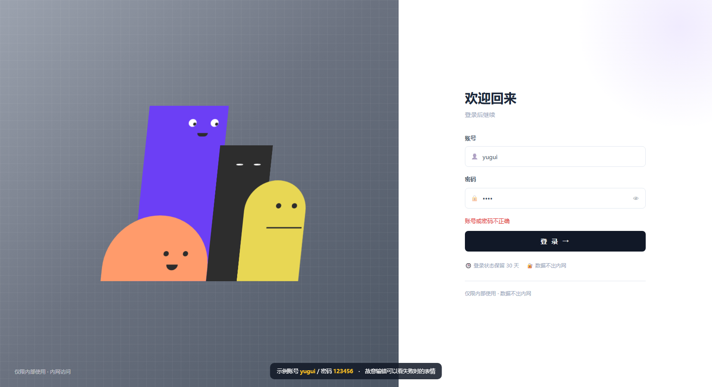

# 会看你的登录页

一个有点意思的登录页：左边四个几何角色的眼睛会跟着鼠标转，光标落进账号框时最高的那个会探头张望，输密码时四个一起别过身去，登录失败集体垮脸，成功则笑起来并撒彩纸。

**纯 HTML / CSS / JavaScript，零依赖，两个文件拷走就能用。**



> **English** — An interactive login page: four flat geometric characters whose eyes follow your cursor, peek when you focus the username field, look away while you type your password, frown on failure and smile with confetti on success. Plain HTML/CSS/JS, **no dependencies, no build step** — copy two files and you are done. Code comments and docs are in Chinese; the API is tiny and documented below.

<!-- 开了 GitHub Pages 之后，把下面这行换成 https://<你的用户名>.github.io/<仓库名>/ -->

**在线演示**：待补 · 也可以直接把仓库下载下来，双击 `示例.html`

## 有什么

- **眼球跟随**：八只瞳孔实时追指针，越近偏得越少，不会顶出眼眶；不用先点页面
- **随输入变表情**：聚焦账号框 → 探头对视；密码框有内容 → 集体别过身；点「显示密码」→ 站直了装作没看，最高那个还会每隔几秒偷瞄一次
- **结果有反馈**：失败垮脸 + 表单抖动，3 秒后自己收；成功笑脸 + 180 片彩纸 + 淡出
- **入场动画**：四个角色从不同方向带回弹弹进来，各有错开的延迟
- **深浅色**：跟随系统，也可锁定
- **零依赖**：没有框架、没有构建、没有字体图标，`file://` 双击直接跑
- **照顾无障碍**：系统开了「减少动态效果」时自动跳过入场动画与彩纸

## 文件

| 文件          | 说明                                                                   |
| ------------- | ---------------------------------------------------------------------- |
| `login.css` | 全部样式：配色令牌、表单、四个角色的造型与动画（约 13 KB）             |
| `login.js`  | 角色行为（`window.Faces`）+ 表单接线（`window.Login`）（约 21 KB） |
| `示例.html` | 可直接打开的完整示例，带一个假的登录校验                               |
| `预览.png`  | 截图                                                                   |

> 想开 GitHub Pages 做在线演示，把 `示例.html` 改名成 `index.html` 即可。

先双击 `示例.html` 看效果：账号 `yugui`、密码 `123456` 能登录成功，随便输错可以看失败时的表情。

## 快速开始

**1. 引入两个文件**

```html
<link rel="stylesheet" href="login.css">
<script src="login.js"></script>
```

**2. 复制 HTML 结构**

把 `示例.html` 里两行注释之间那一整段（`<div id="login">…</div>`）复制到你的页面。需要改的只有文案：标题「欢迎回来」、副标题、下面两条小字。

**3. 接上你的登录请求**

```js
Login.init({
  onSubmit: function (user, pass) {
    return fetch('/api/login', {
      method: 'POST',
      headers: { 'Content-Type': 'application/json' },
      body: JSON.stringify({ username: user, password: pass })
    }).then(function (r) {
      return r.ok ? true : { ok: false, message: '账号或密码不正确' };
    });
  },
  onDone: function () {
    // 登录页淡出之后调这里，把你自己的主界面显示出来
    document.getElementById('app').classList.remove('hidden');
  }
});
```

`onSubmit` 返回 `true` / `false` / `{ ok: false, message: '提示语' }`，或它们的 Promise。成功就撒花、停 2.2 秒、淡出再调 `onDone`；失败就垮脸、抖一下表单、把 `message` 显示在按钮上方。

## API

### `Login.init(options)`

| 参数             | 类型                     | 默认      | 说明                                                                             |
| ---------------- | ------------------------ | --------- | -------------------------------------------------------------------------------- |
| `onSubmit`     | `(user, pass) => 结果` | —        | **必填**。返回 `true` / `false` / `{ok, message}` 或它们的 Promise   |
| `onDone`       | `() => void`           | —        | 登录成功且页面淡出后调用                                                         |
| `successDelay` | `number`               | `2200`  | 成功后停留多久再淡出（毫秒），够看清笑脸和彩纸                                   |
| `fadeMs`       | `number`               | `400`   | 淡出时长；改了要同步改`login.css` 里 `#login` 的 `transition`              |
| `autoFocus`    | `boolean`              | `false` | 是否自动聚焦账号框。默认关：光标一落进去就会触发探头动作，留给用户自己点更有意思 |
| `ids`          | `object`               | 见下      | 元素 id 不一样时用它覆盖，只传要改的那几个                                       |

`init()` 会自己等 `DOMContentLoaded`，写在 `<head>` 里也没问题。

### 方法

| 方法                                          | 说明                                                             |
| --------------------------------------------- | ---------------------------------------------------------------- |
| `Login.show()`                              | 显示登录页并**重放入场动画**（退出登录后回到登录页时调它） |
| `Login.hide()`                              | 隐藏                                                             |
| `Login.faces('fail' \| 'succeed' \| 'reset')` | 手动触发表情                                                     |

想更细地控制角色，`window.Faces` 也是公开的：`enter()` 重放入场、`set({typing, showPassword, passwordLength})` 同步输入状态、`fail()` / `succeed()` / `reset()`。

### 需要的元素 id

| id                          | 元素                                | 必需 |
| --------------------------- | ----------------------------------- | ---- |
| `login`                   | 最外层容器（带`hidden` 类时隐藏） | 是   |
| `stage`                   | 角色舞台                            | 是   |
| `login-form`              | `<form>`                          | 是   |
| `username` / `password` | 两个输入框                          | 是   |
| `pw-toggle`               | 显示密码的眼睛按钮                  | 否   |
| `login-error`             | 显示错误提示的那行                  | 否   |
| `login-btn`               | 提交按钮，请求期间会被禁用          | 否   |

## 定制

| 想改什么         | 改哪里                                                                                                                     |
| ---------------- | -------------------------------------------------------------------------------------------------------------------------- |
| 配色             | `login.css` 顶部 `:root` 的令牌，浅色深色各一套                                                                        |
| 左侧背景         | `.login-stage` 的 `background`（默认是灰色渐变 + 网格纹理）                                                            |
| 角色大小         | `.stage` 的 `--stage-scale`（默认 `1.2`），窄屏矮屏有媒体查询自动降档                                                |
| 角色的位置与颜色 | `.ch-purple` / `.ch-black` / `.ch-orange` / `.ch-yellow` 四条规则里的 `left` `width` `height` `background` |
| 动作时长         | `login.js` 顶部的 `ENTRANCE_MS`、`BLINK_MIN` / `BLINK_RAND`、`LOOK_MS`、`PEEK_MS`                              |
| 锁定深浅色       | `<html data-theme="auto">` 改成 `light` 或 `dark`                                                                    |

## 角色什么时候做什么

| 时机         | 表现                                                                                |
| ------------ | ----------------------------------------------------------------------------------- |
| 载入         | 四个角色从不同方向带回弹弹进来（1\~1.3 秒，错开延迟）                               |
| 常态         | 八只瞳孔跟随指针，身体最多侧倾 6 度                                                 |
| 随机         | 每个角色各自每 3\~7 秒眨一次眼，互不同步                                            |
| 光标进账号框 | 紫色探头：长高 40px、侧倾 12 度、右移 40px，嘴抽成竖条；黑色凑过去，两个对视 0.8 秒 |
| 密码框有内容 | 紫色保持探头姿态                                                                    |
| 点了显示密码 | 四个身体站直、脸移到左侧集体看向左上，紫色每 2\~5 秒偷瞄一次                        |
| 登录失败     | 紫色橙色的嘴翻过来、黄色画成波浪、黑色眼睛垮成八字，3 秒后自己收                    |
| 登录成功     | 三张嘴变笑脸（黑色本来就没有嘴，靠眼睛上扬表达），撒 180 片彩纸                     |

## 浏览器支持

Chrome / Edge 108+、Safari 17.4+ 完整支持。

**Firefox 有一处降级**：黄色角色的嘴用的是 CSS 的 `d: path()` 属性，Firefox 目前还不支持，所以它的嘴会一直是直线，失败时的波浪和成功时的笑不会出现——**其余一切正常**。介意的话把 `login.js` 里切 `wavy` / `happy` 类的两行改成直接写 SVG 的 `d` 属性即可。

## 几个坑

- **入场动画必须在元素可见之后触发**：`display:none` 期间 CSS 动画不走。所以从别的界面切回登录页要调 `Login.show()`，而不是自己去掉 `hidden` 类
- **绕开 `Login` 直接用 `Faces` 时**，得自己确保在 DOM 就绪之后调
- `示例.html` 里有 `<meta name="viewport" content="width=980">`，是为了适配触屏大屏。要做手机端就删掉它，`login.css` 里有 900px 的断点会把布局改成上下排
- 彩纸挂在 `<body>` 上、`position:fixed`，切到主界面后会继续落完（约 7 秒），这是有意的
- 这只是个**前端外壳**：真正的校验必须在服务端做，`onSubmit` 里请求你自己的接口

<!-- 原作者明确许可后，把上面这段换成正式的 LICENSE 说明，并在仓库根目录补一个 LICENSE 文件 -->
